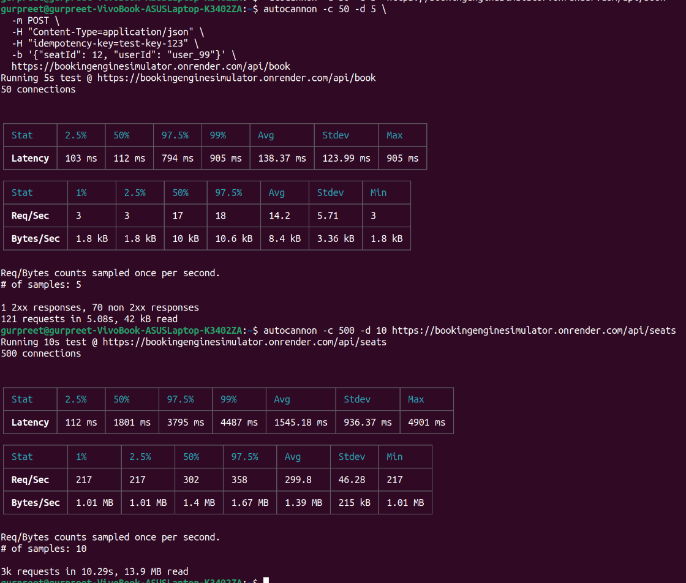

# High-Concurrency Ticket Booking System

A distributed, fully-featured, race-condition-immune Ticket Booking engine and Live Simulator.

This system demonstrates how to securely handle high-concurrency flash-sales for events/tickets without succumbing to double-bookings or phantom reads, utilizing real-time database-level pessimistic locking and queue-based auto-rollbacks.

## Tech Stack
* **Frontend:** React + Vite
* **Backend API:** Node.js + Express
* **Database Management:** Prisma ORM
* **Relational Core:** PostgreSQL 15 (Leveraging `SELECT ... FOR UPDATE` Locks)
* **Message Broker / Cache:** Redis 7 
* **State Machine Queue:** BullMQ

## How It Works Under The Hood

1. **Idempotency checks:** Every network request from the client provides an `idempotency-key`. Redis checks this immediately to guarantee zero double-charges from network jitters (e.g., impatient users repeatedly clicking).
2. **Pessimistic Row-Level Locks:** If 1,000 users click the same exact seat at the same millisecond, PostgreSQL physically locks that distinct row via Prisma's `$queryRaw FORMAT` parameters. One transaction slips through, while all others block.
3. **Queue Rollbacks:** When a seat is successfully marked as `PENDING`, a background BullMQ `Worker` fires on a 30-second delay. If a webhook payment is not received confirming the seat as `BOOKED`, the Worker automatically wipes the pending status and refunds the seat to the `AVAILABLE` pool.
4. **Cache-Aside Pattern:** The Seat Map aggressively utilizes Redis to read state in sub-milliseconds rather than crippling the SQL database.

---

## 🛠️ Local Development Setup

### 1. Boot up the Infrastructure
Ensure Docker is installed on your machine. Start the PostgreSQL and Redis containers:
```bash
docker-compose up -d
```

### 2. Configure the Backend (Server)
Start a new terminal and initialize the Node.js API server:
```bash
cd server
npm install

# Push the schema constraints to Postgres & seed the database with mock seats
npx prisma db push
node prisma/seed.js

# Start the server (runs on port 5000)
npm run dev
```

### 3. Configure the Frontend (Client)
Start a separate terminal for the React UI:
```bash
cd client
npm install

# Start the client (runs on port 5173 by default)
npm run dev
```

### 4. Run the Application
Open your browser and navigate to `http://localhost:5173`. 

---

## 🔬 Testing the Race Conditions

The local dashboard comes with a built-in **Concurrency Simulator**:
1. Select a target seat in the Control Panel dropdown.
2. Click **Fire Concurrent Load Test**.
3. Watch the **Live HTTP Tracker** on the right side. The UI natively launches 5 parallel Promises against the Backend simultaneously. 
4. The Tracker will display the exact Millisecond Latency waterfall. You will see Postgres naturally admit the first network ping (`200 LOCKED`), and subsequently safely block and discard the remaining 4 parallel requests gracefully with strict HTTP `409` rejections.

---

## 📊 Infrastructure Performance Testing

The system architecture was stress-tested using **Autocannon** to benchmark distributed throughput, evaluate network footprint, and validate transaction locking layers under load.

<details>
<summary><b>📷 View Autocannon Benchmark Logs (Write vs. Read Paths)</b></summary>



### 1. Concurrency Mutation Path (`POST /api/book`)
* **Objective:** Verify idempotency stability and row-level write locking under overlapping parallel triggers.
* **Result:** Successfully enforced strict database isolation—only **1** transaction passed cleanly to alter the database state, while duplicate race condition hits were immediately deflected (`70 non-2xx conflict responses`).

```text
┌─────────┬────────┬────────┬────────┬────────┬───────────┬───────────┬────────┐
│ Stat    │ 2.5%   │ 50%    │ 97.5%  │ 99%    │ Avg       │ Stdev     │ Max    │
├─────────┼────────┼────────┼────────┼────────┼───────────┼───────────┼────────┤
│ Latency │ 103 ms │ 112 ms │ 794 ms │ 905 ms │ 138.37 ms │ 123.99 ms │ 905 ms │
└─────────┴────────┴────────┴────────┴────────┴───────────┴───────────┴────────┘
┌───────────┬────────┬────────┬───────┬─────────┬────────┬─────────┬────────┐
│ Stat      │ 1%     │ 2.5%   │ 50%   │ 97.5%   │ Avg    │ Stdev   │ Min    │
├───────────┼────────┼────────┼───────┼─────────┼────────┼─────────┼────────┤
│ Req/Sec   │ 3      │ 3      │ 17    │ 18      │ 14.2   │ 5.71    │ 3      │
├───────────┼────────┼────────┼───────┼─────────┼────────┼─────────┼────────┤
│ Bytes/Sec │ 1.8 kB │ 1.8 kB │ 10 kB │ 10.6 kB │ 8.4 kB │ 3.36 kB │ 1.8 kB │
└───────────┴────────┴────────┴───────┴─────────┴────────┼─────────┴────────┘

Req/Bytes counts sampled once per second.
# of samples: 5

1 2xx responses, 70 non 2xx responses
121 requests in 5.08s, 42 kB read
```

### 2. Cache-Aside Read Path (`GET /api/seats`)

* **Objective:** Benchmark high-concurrency layout fetch thresholds and evaluate Redis offloading efficiency.
* **Result:** Handled a heavy read spike of **500 concurrent connections**, processing **3,000+ total requests** with zero connection dropouts at an average throughput velocity of **299.8 Req/Sec**.

```text
┌─────────┬────────┬─────────┬─────────┬─────────┬────────────┬───────────┬─────────┐
│ Stat    │ 2.5%   │ 50%     │ 97.5%   │ 99%     │ Avg        │ Stdev     │ Max     │
├─────────┼────────┼─────────┼─────────┼─────────┼────────────┬───────────┬─────────┤
│ Latency │ 112 ms │ 1801 ms │ 3795 ms │ 4487 ms │ 1545.18 ms │ 936.37 ms │ 4901 ms │
└─────────┴────────┴─────────┴─────────┴─────────┴────────────┬───────────┬─────────┘
┌───────────┬─────────┬─────────┬────────┬─────────┬─────────┬────────┬─────────┐
│ Stat      │ 1%      │ 2.5%    │ 50%    │ 97.5%   │ Avg     │ Stdev  │ Min     │
├───────────┼─────────┼─────────┼────────┼─────────┼─────────┼────────┼─────────┘
│ Req/Sec   │ 217     │ 217     │ 302    │ 358     │ 299.8   │ 46.28  │ 217     │
├───────────┼─────────┼─────────┼────────┼─────────┼─────────┼────────┼─────────┤
│ Bytes/Sec │ 1.01 MB │ 1.01 MB │ 1.4 MB │ 1.67 MB │ 1.39 MB │ 215 kB │ 1.01 MB │
└───────────┴─────────┴─────────┴────────┼─────────┴─────────┴────────┴─────────┘

Req/Bytes counts sampled once per second.
# of samples: 10

3k requests in 10.29s, 13.9 MB read
```

</details>
